# Class Diagrams by Service

## api-gateway

No explicit class definitions were found in this service. The gateway is function-based.

## auth-service

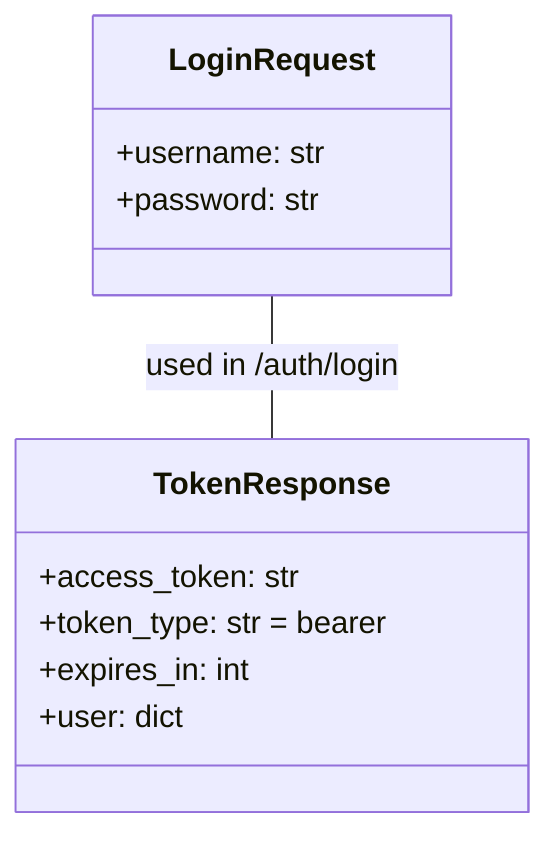

## customer-service

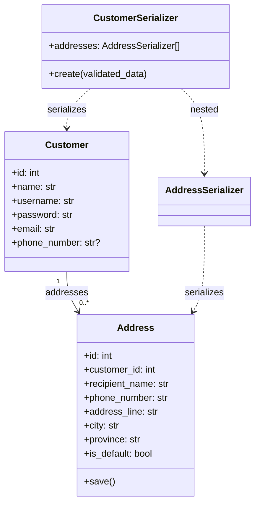

## cart-service

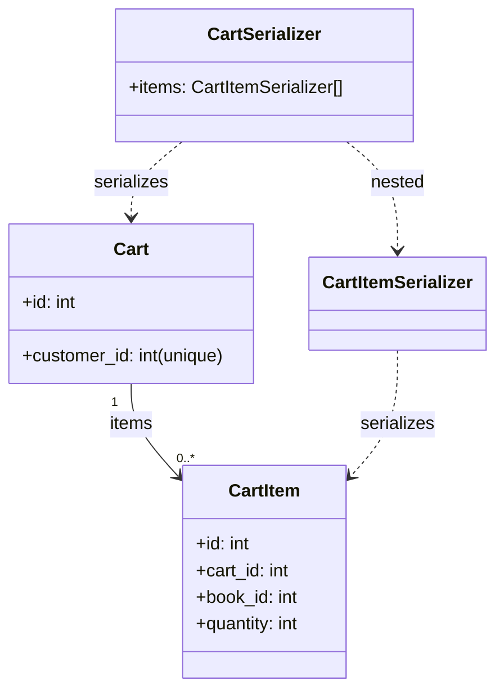

## book-service

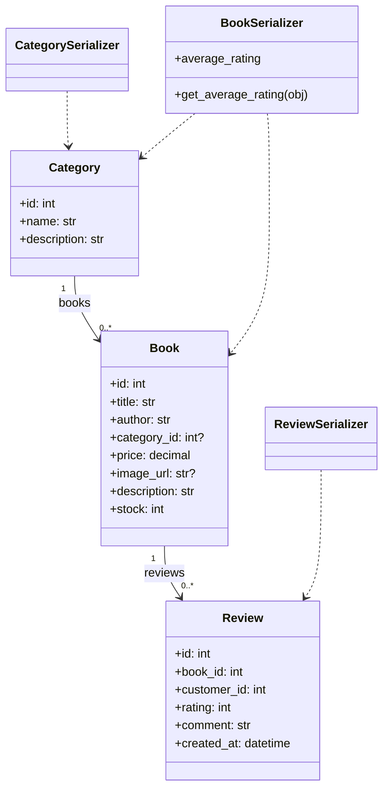

## staff-service

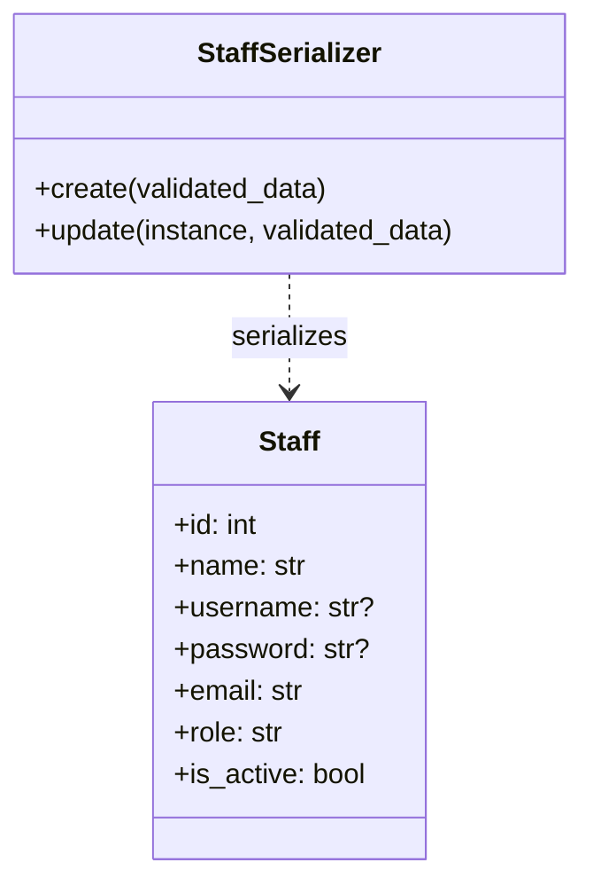

## catalog-service

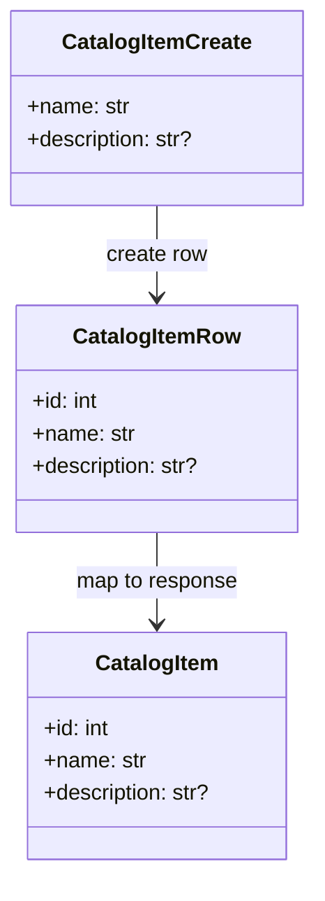

## order-service

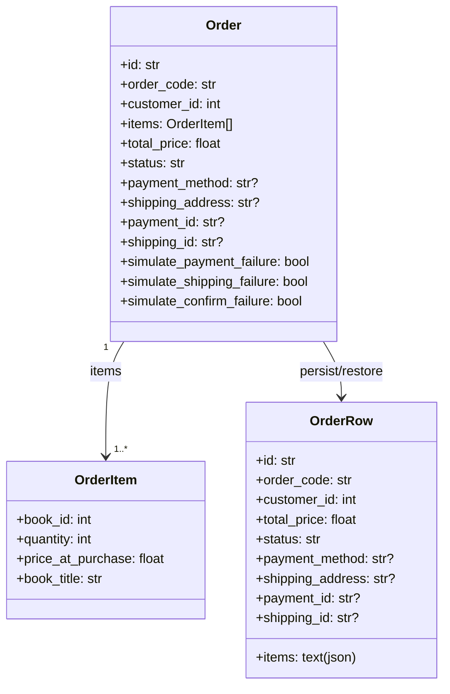

## payment-service

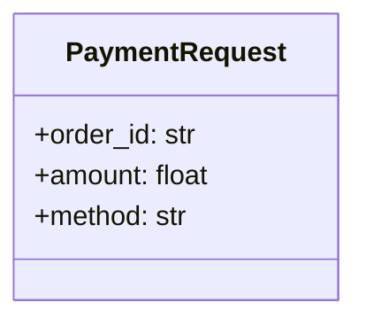

## shipping-service

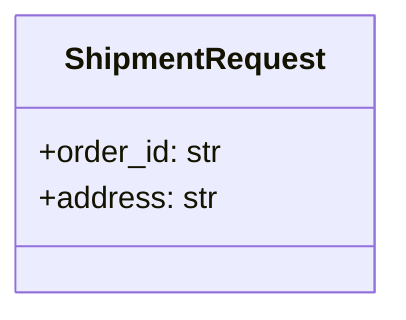

## manager-service

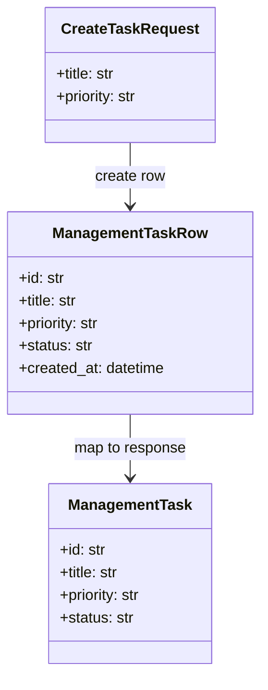

## comment-rate-service

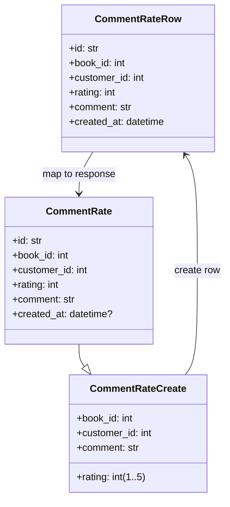

## recommender-ai-service

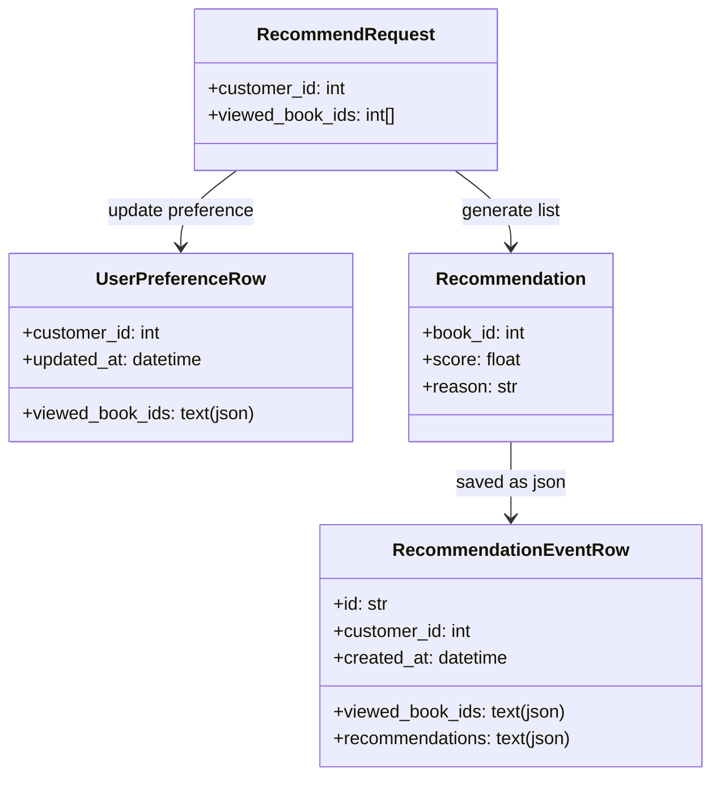
